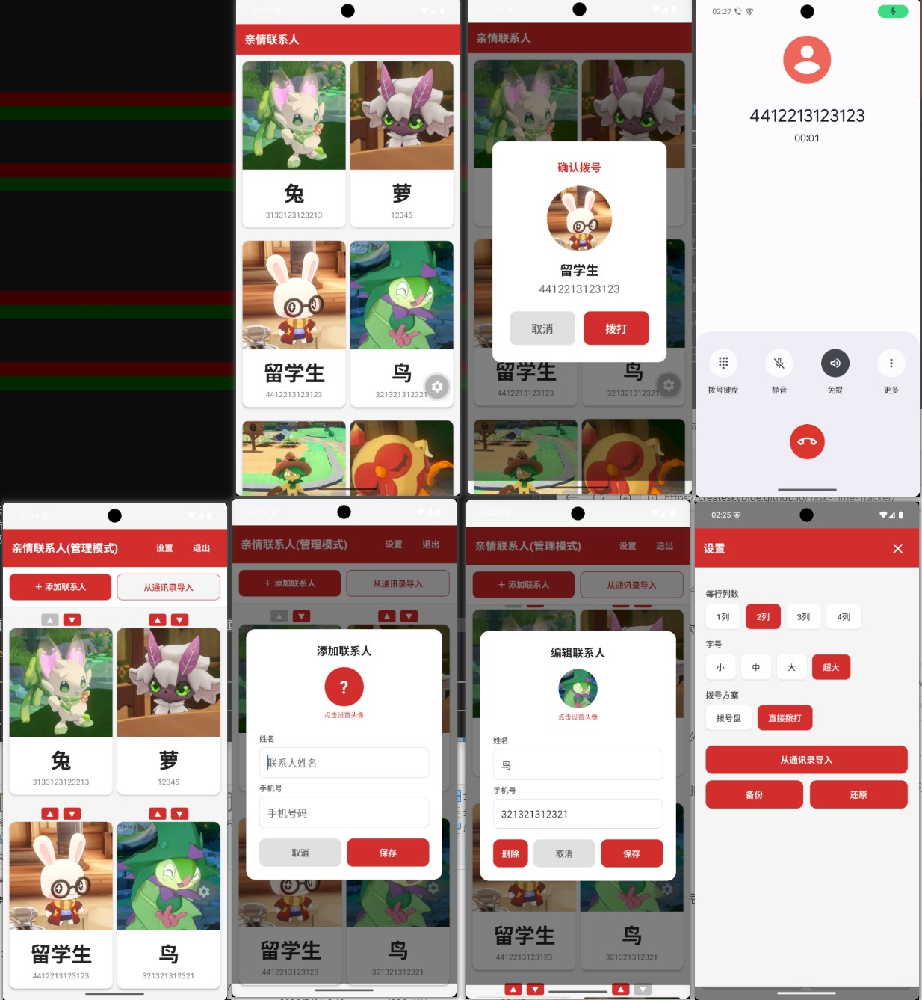

# 亲情联系人

一款专为老年人设计的 React Native Android 应用，大字体、大头像，点击即可拨号。无需注册、无需联网权限。

## 功能概览

| 功能 | 说明 |
|------|------|
| 🔴 一键拨号 | 点击联系人卡片 → 确认 → 直接拨出电话 |
| 📷 大头像 | 支持从任意目录选择照片，卡片上半部分为头像 |
| 🔤 超大字体 | 4 档可调字号（小/中/大/超大），默认大字 |
| 📱 通讯录导入 | 从系统通讯录批量导入联系人 |
| 🔒 隐藏管理模式 | 无密码，防老人误触进入设置 |
| 🌐 完全离线 | 无需网络，无需任何权限弹窗（除拨号和通讯录） |

## 截图



## 使用方式

### 老人模式（默认）

打开 App 即进入老人模式，点击任意联系人卡片弹出拨号确认框，确认后直接拨打。

### 进入管理模式

**左上角标题"亲情联系人"连续点击 20 次**（60 秒内），即可进入管理模式。

管理模式提供以下功能：
- **添加联系人**：右下角 + 按钮
- **编辑联系人**：点击任意联系人卡片
- **排序**：▲▼ 按钮调整顺序
- **删除**：编辑页面点击"删除"
- **设置**：右上角齿轮图标

### 设置选项

| 设置项 | 说明 |
|--------|------|
| 每行列数 | 1~4 列，控制卡片布局 |
| 字号 | 小/中/大/超大，默认大 |
| 拨号方案 | 拨号盘 / 直接拨打 |
| 从通讯录导入 | 批量导入系统联系人 |

## 构建

```bash
# 安装依赖
npm install

# 开发调试（需要 Expo Go）
npx expo start --clear

# 构建 Release APK
cd android && ./gradlew assembleRelease
```

APK 输出路径：`android/app/build/outputs/apk/release/app-release.apk`

详细构建指南见 [docs/BUILD.md](docs/BUILD.md)

## 技术栈

- React Native 0.86 + Expo SDK 57
- TypeScript
- AsyncStorage 本地存储
- expo-document-picker 照片选择
- expo-sharing 备份分享
- JSZip 备份压缩
- Hermes 引擎

## 下载

最新 APK 请在 [Releases](https://github.com/createskyblue/KinshipContact/releases) 页面下载。
